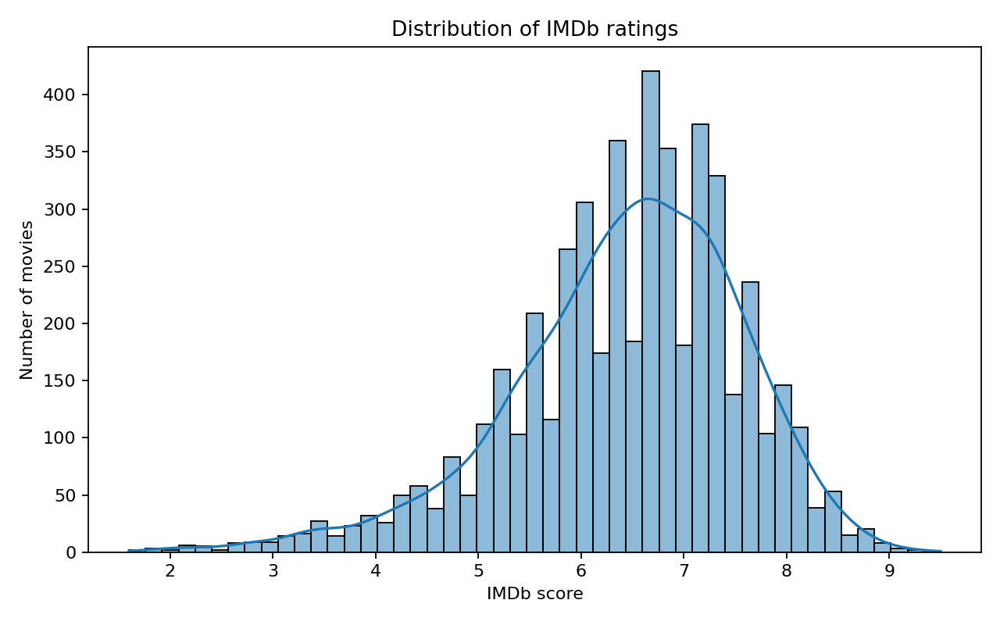
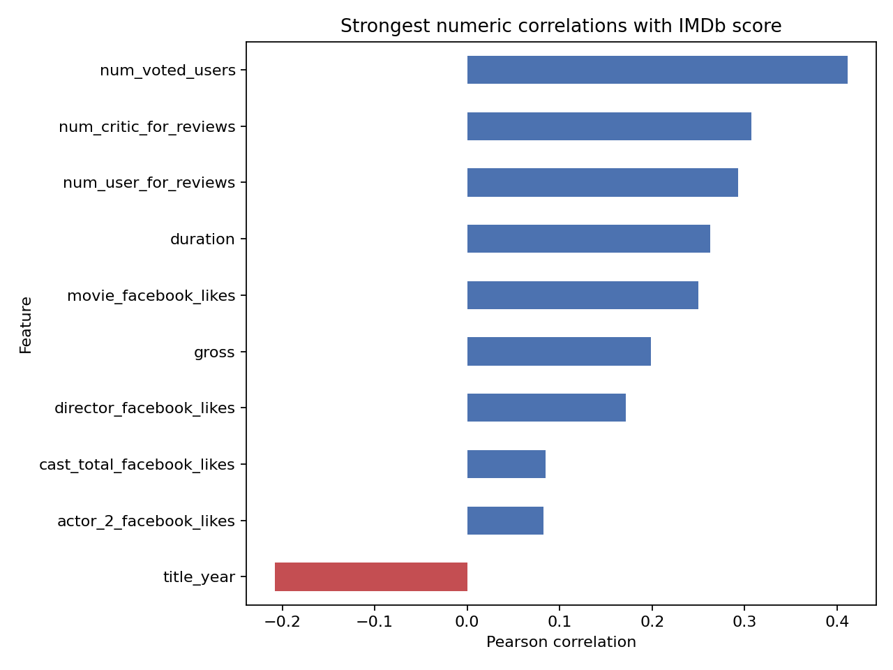
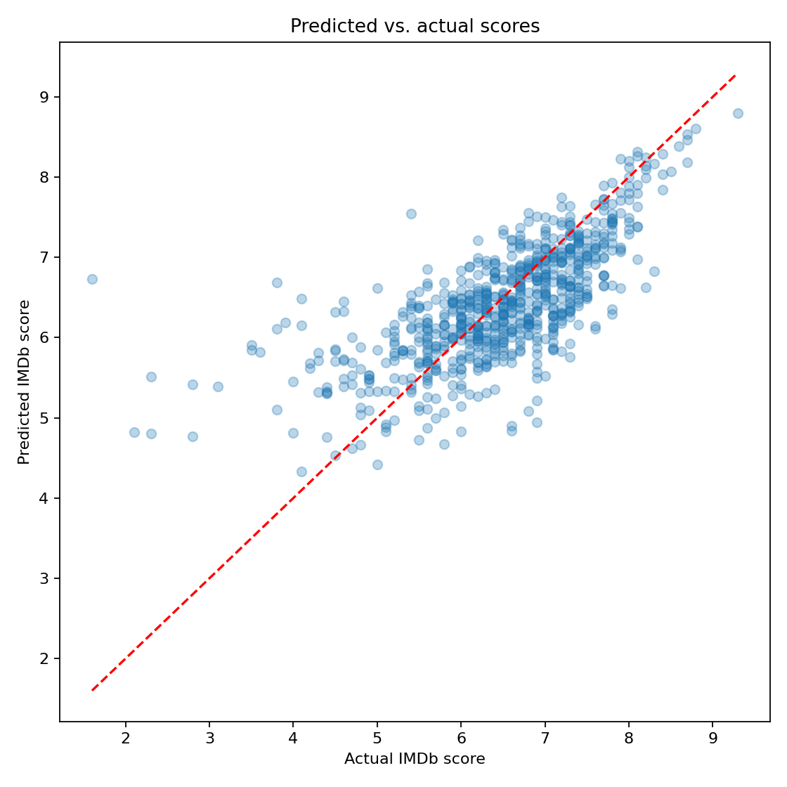

# IMDb Rating Prediction

An end-to-end machine learning project that explores which numeric movie
features are associated with IMDb ratings and how accurately those ratings can
be predicted.

## What the project covers

- Duplicate removal and missing-value analysis
- Exploratory data analysis
- Pearson correlation analysis
- Reproducible train, validation, and test splits
- Linear regression as a baseline
- Random forest regression
- Model selection on validation data
- Final evaluation on previously unseen test data

## Results

The analysis uses 4,998 movies after duplicate removal. A complete-case numeric
dataset provides 3,768 movies and 15 input features.

| Model | Validation R² |
|---|---:|
| Linear regression | 0.32 |
| Random forest | 0.56 |

The selected random forest reaches an R² of 0.51 and a mean absolute error of
0.52 IMDb score points on the test set.







The model is an explanatory experiment rather than a pre-release prediction
system. Several strong features, such as vote counts and revenue, are only
available after a movie has been released. Complete-case filtering also removes
24.6% of the available rows.

## Dataset

This project uses the
[IMDb 5000 Movie Dataset](https://www.kaggle.com/datasets/carolzhangdc/imdb-5000-movie-dataset).
The dataset is not included in this repository.

Download `movie_metadata.csv` from Kaggle and place it here:

```text
data/movie_metadata.csv
```

## Run locally

```bash
python -m pip install -r requirements.txt
python src/analysis.py
```

The script writes the metrics and generated charts to `outputs/`.

You can also select different paths:

```bash
python src/analysis.py --data path/to/movie_metadata.csv --output path/to/results
```

## Project structure

```text
imdb-rating-prediction/
├── data/
├── outputs/
│   ├── metrics.json
│   ├── predicted_vs_actual.png
│   ├── score_distribution.png
│   └── target_correlations.png
├── src/
│   └── analysis.py
├── .gitignore
├── README.md
└── requirements.txt
```

## Acknowledgement

This repository presents my independent course project. AI tools were used for
programming support and concept explanations. I completed and reviewed the
analysis, implementation, and interpretation.
